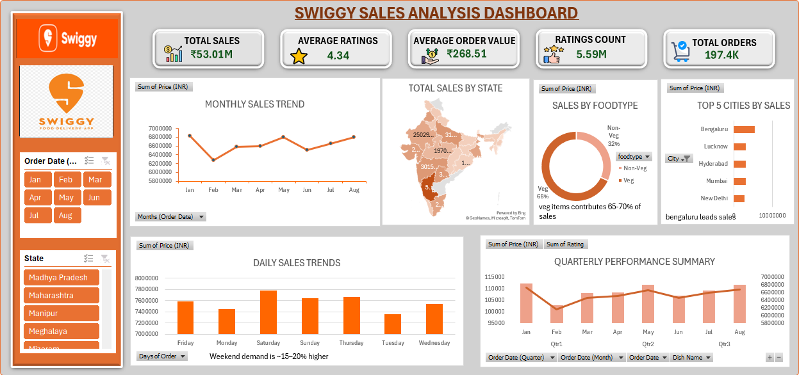
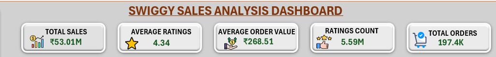

# Swiggy Sales Dashboard Analysis

## Overview

This project presents an interactive Excel dashboard built to analyze Swiggy sales data and uncover insights related to customer behavior, restaurant performance, pricing trends, and food category demand.

The analysis was performed using Microsoft Excel with Pivot Tables, KPIs, charts, slicers, and calculated columns to transform raw data into an interactive business dashboard.

The dataset contains approximately **197,000+ records** across multiple cities, restaurants, dishes, and categories.

---

## Project Objectives

* Analyze restaurant and food category performance
* Track pricing and rating trends
* Identify high-performing dishes and locations
* Build an interactive dashboard for business insights
* Practice real-world Excel data analysis workflow

---

## Dataset Information

The dataset includes approximately **197,430 rows** and multiple business-related fields such as:

* State
* City
* Order Date
* Restaurant Name
* Location
* Category
* Dish Name
* Price (INR)
* Rating
* Rating Count

### Additional Columns Created

To improve the analysis and dashboard functionality, additional calculated/helper columns were created, including:

* Days of Order
* Food Type classification
* KPI calculations
* Pivot-based aggregations for dashboard reporting

---

## Tools & Features Used

* Microsoft Excel
* Pivot Tables
* Pivot Charts
* KPI Cards
* Slicers
* Data Cleaning
* Conditional Formatting
* Interactive Dashboard Design

---

## Dashboard KPIs

The dashboard tracks key business metrics including:

* Total Orders
* Average Rating
* Restaurant Performance
* Category-wise Analysis
* Price Trends
* Top Performing Dishes
* Location-based Insights

---

## Key Insights

* Identified top-performing restaurants based on ratings and order trends
* Analyzed category-wise food demand across locations
* Compared pricing patterns between restaurants and food categories
* Tracked customer preferences using ratings and order activity
* Created interactive filters for dynamic dashboard analysis

---

## Dashboard Preview

### Main Dashboard



### KPI Section



---

## Files Included

```text
swiggy-sales-dashboard/
│
├── README.md
├── Dashboard.png
├── KPI's.png
├── Swiggy Raw Data .csv
├── swiggy sales analysis dashboard.xlsx
```

## Conclusion

This project demonstrates practical Excel skills used in data analysis, including data cleaning, pivot-based reporting, KPI tracking, and dashboard creation. The dashboard was designed to convert raw Swiggy sales data into meaningful business insights using interactive visualizations.

Author

Ayush Gupta — Aspiring Data Analyst

GitHub: https://github.com/Ayu-shhh20